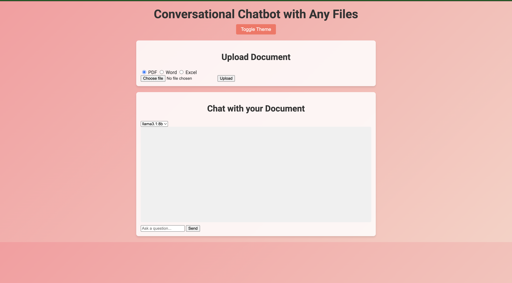
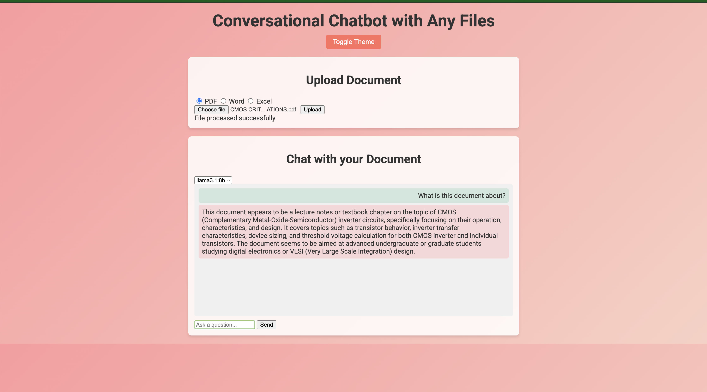
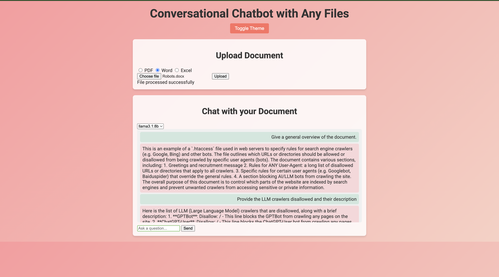

# Conversational Chatbot with Any Files

A powerful AI-driven chatbot that enables users to upload and query PDF, Word, and Excel documents. Built with Flask, LangChain, and Ollama, it provides intelligent responses based on document content. Optional MongoDB integration allows conversation logging for reference. The user-friendly interface includes theme toggling and model selection.

---

## Overview
This project allows users to upload various document formats (PDF, Word, Excel) and query their content through an interactive chatbot. The chatbot is powered by a local LLM using Ollama, while Flask manages the backend for file processing and chat routing. MongoDB is optionally used for storing conversation logs. The modern UI offers features like a theme toggle and model selection.

---

## Features
- **Document Processing:** Upload and extract text from PDF, Word, and Excel files.
- **Conversational AI:** Ask questions related to uploaded documents and receive context-aware responses.
- **Model Selection:** Choose different LLM models (e.g., "llama3.1:8b").
- **Theme Toggle:** Switch between light and dark modes for better usability.
- **MongoDB Logging (Optional):** Store chat history for future reference.
- **Modern UI:** User-friendly and responsive interface.

---

## Project Structure
```
chatbot_project/
├── app.py                   # Main Flask application with routes (/ , /upload, /chat)
├── requirements.txt         # Python dependencies
├── .gitignore               # Git ignore rules
├── README.md                # Project documentation
├── templates/
│   └── index.html           # HTML template for the UI
├── static/
│   ├── css/
│   │   └── style.css        # CSS styling (modern, vibrant)
│   └── js/
│       └── script.js        # Client-side JavaScript for interactivity
├── uploads/                 # Folder for uploaded documents
└── utils/
    ├── file_processing.py   # Functions to extract text from PDF/Word/Excel files
    ├── langchain_integration.py  # Custom LLM wrapper for Ollama
    └── database.py          # MongoDB integration for conversation logging
```

---

## Installation & Setup

1. **Clone the Repository:**  
   ```bash
   git clone https://github.com/your_username/Conversational-FileChatbot.git
   cd Conversational-FileChatbot
   ```

2. **Create and Activate a Virtual Environment:**  
   On macOS/Linux:
   ```bash
   python3 -m venv env3
   source env3/bin/activate
   ```  
   On Windows:
   ```bash
   python -m venv env3
   env3\Scripts\activate
   ```

3. **Install Dependencies:**  
   ```bash
   pip install -r requirements.txt
   ```

4. **Configure MongoDB (Optional):**  
   Ensure MongoDB is running on `localhost:27017` for logging chat history. To disable logging, comment out the `database.log_conversation(...)` call in `app.py`.

5. **Start Ollama:**  
   Pull your desired model (e.g., `llama3.1:8b`) and run:
   ```bash
   ollama serve
   ```  
   Ensure the model is accessible at `http://127.0.0.1:11434/api/generate`.

6. **Run the Flask App:**  
   ```bash
   python app.py
   ```  
   Open [http://localhost:5000](http://localhost:5000) in your browser.

---

## Usage

1. **Upload a Document:**  
   Use the file upload section to select a PDF, Word, or Excel file. The server extracts text for processing.
2. **Interact via Chat:**  
   Type your query in the chat box; the chatbot uses the document content and your query to generate a response.
3. **Toggle Theme:**  
   Click the "Toggle Theme" button to switch between light and dark modes.
4. **Select Model:**  
   Use the dropdown to choose the desired language model.

---

## Screenshots

### Homepage


### Chatbot Processing Query


### Chatbot Response


---

## Demo Video

Watch the demonstration of the chatbot in action:

[](https://youtu.be/gZKV2R5Qfzs)

Click on the thumbnail above or [watch it on YouTube](https://youtu.be/gZKV2R5Qfzs).

---

## Contributing

Contributions are welcome! To contribute:
1. Fork this repository.
2. Create a new branch for your feature or bug fix.
3. Commit your changes with descriptive messages.
4. Open a pull request with a detailed description of your improvements.

---

## License

This project is licensed under the **MIT License**. See the LICENSE file for details.

Made with ❤️ by Deep

